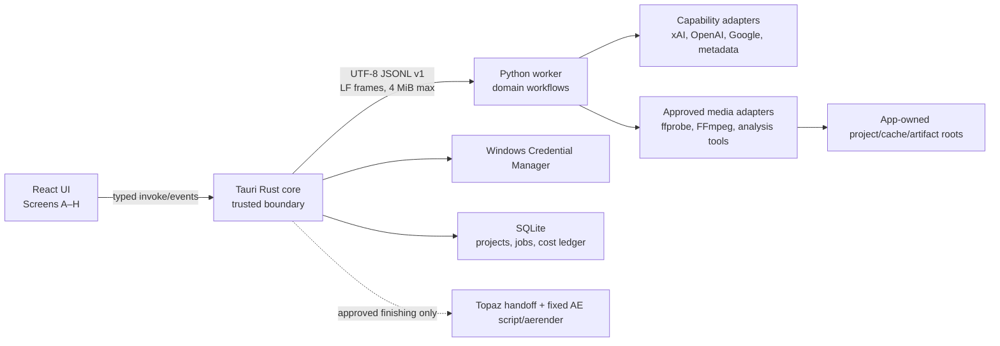

# AI Edit Machine Architecture

**Decision status:** Milestone 0 foundation accepted; Milestone 1 explicitly approved on 2026-08-15. Milestone 2 is not approved.  
**Primary target:** signed Windows 11 x64 desktop application.

## Product boundary

AI Edit Machine is a guided fandom-edit workflow, not a general nonlinear editor. Its value chain is:

1. Find a current, evidence-backed opportunity.
2. Ask for concrete, lawfully obtained footage.
3. Build a reusable local media map.
4. Propose explainable intro/montage concepts.
5. Render cheap, effect-free rough cuts.
6. Let the user revise and approve.
7. Only then run deterministic Topaz/After Effects finishing.

LLMs resolve ambiguity, meaning, and taste. Deterministic code owns files, exact time, budgets, schemas, crops, effects, velocity, and rendering.

## Component and trust model



The WebView renderer is untrusted. It receives no generic shell capability, arbitrary filesystem access, raw credential-read operation, or ability to launch programs. Narrow Rust commands validate every path and request.

## Runtime responsibilities

### React + strict TypeScript

- Implements the eight product screens and local playback/timeline interaction.
- Treats all backend messages as versioned contracts.
- Can submit a newly typed secret once, then only query configured/valid/delete status.
- Never creates command lines, resolves arbitrary local paths, or computes authoritative costs.

### Tauri Rust core

- Owns file/folder dialogs, app-owned root resolution, path canonicalization, and capabilities.
- Stores/retrieves provider keys through Windows Credential Manager.
- Owns SQLite migrations, connection configuration, and the durable job/cost ledger.
- Starts only a version/Windows-x64/exact-file-set-verified development worker and approved external tools under Windows Job Objects. The trusted Rust host embeds the worker bundle's build-time relative-path/size/SHA-256 manifest, so a mutable sibling manifest is never the trust anchor. Shipped release workers additionally require Authenticode at the commercial packaging gate.
- Enforces request size, protocol version, operation allowlists, cancellation, timeout, and process-tree cleanup.
- Writes rotated/redacted JSONL logs and streams typed progress events to the UI.
- Ships minimal capability files, restrictive CSP, blocked remote navigation, allow-listed system-browser URLs, bounded invoke payloads, and production devtools off. Release audit rejects generic shell/filesystem/process/opener permissions.

The renderer should not receive Tauri's generic shell plugin. Expose one custom Rust operation per needed capability.

### Python worker

- Implements deterministic workflows and provider adapters.
- Performs schema validation, domain validation, evidence normalization, media analysis, ranking, and EDL construction.
- Emits protocol frames only on stdout; logs go to stderr/file.
- Has no listening socket. FastAPI is reserved for a future opt-in remote/headless mode.
- Never receives a filesystem path or executable choice directly from model output.

### External processes

- Every executable is discovered through an audited installation/bundle registry and invoked with an argv array, never a shell string.
- FFmpeg uses `-nostdin` by default, `-progress` on a dedicated pipe, bounded startup/idle/overall timeouts, app-owned temp output, ffprobe verification, and destination-volume finalization. If cooperative `q` is required, Rust creates a dedicated stdin pipe rather than sharing protocol input.
- Cooperative cancellation is attempted first; after timeout, Rust terminates the Windows Job Object.
- Supervisor-owned `aerender` is serialized with GPU-heavy jobs. Current Topaz is manual and therefore has no owned-process progress/cancellation semantics.

## Sidecar protocol

Use exactly one UTF-8 JSON object per LF-terminated line on inherited stdio. Embedded newlines are escaped JSON characters; each encoded frame is at most 4 MiB. Worker stdout is protocol-exclusive, while diagnostics and child output go to stderr/files or separate pipes. The handshake must complete in five seconds. Malformed, oversized, or truncated frames and unexpected EOF fail the active job, kill/restart the worker, and never attempt stream resynchronization. A frame includes:

```json
{
  "protocol_version": "1.0.0",
  "message_type": "request",
  "request_id": "bc397018-02a3-4377-a60e-03a61d430087",
  "job_id": "919c5c73-4184-4591-947c-e123d5f4d27a",
  "operation": "research.run",
  "payload_schema": "research-intent/1.0.0",
  "payload": {}
}
```

Response/event types are `hello`, `accepted`, `progress`, `result`, `error`, `cancel_ack`, `heartbeat`, and `shutdown_ack`. Unknown versions, operations, or fields fail closed. Rust applies bounded request/event rates and payload sizes. The renderer refers to large video/binary data only through app-issued handles. Rust resolves a handle to a canonical, allow-listed path/capability in a worker request; the path is never accepted from model text and binary data is never embedded in JSON.

## Durable job state

```text
QUEUED → RUNNING → SUCCEEDED | FAILED
                   ↘ CANCELLING → CANCELLED
startup orphan RUNNING → INTERRUPTED
```

Manual Topaz handoff adds a durable `WAITING_FOR_USER_EXTERNAL_PROCESS` state. Managed GPU jobs pause; the UI offers import/verify, skip, or cancel acknowledgement. The app does not report external Topaz progress or claim that it can terminate the user's process.

Each job stores operation/schema versions, input fingerprint, reserved/actual cost, progress, owner project, start/finish/heartbeat times, output artifact IDs, cancellation state, and sanitized failure detail. Work is idempotent by operation key. Restart recovery never guesses that a partial file is complete.

## Research flow (Milestone 1)

1. Parse the user's natural-language niche into a strict `ResearchIntent`.
2. Resolve a bounded time window, locale, content type, spoiler policy, and exclusions.
3. Seed television candidates from TVmaze; use official studio/distributor pages for film until a licensed movie-metadata adapter is approved.
4. Search curated official YouTube channel IDs for trailers/clips; return canonical links only in M1 and refresh/delete public metadata within 30 days. Do not derive the opportunity score from engagement fields.
5. Run Grok 4.6 X Search for qualitative fandom leads only after the invocation-cap test passes; allow a configured 4.3 cost fallback after evaluation. Use one tool type, no parallel tool calls, bounded turns/output, and reconcile native cost ticks.
6. Open and verify canonical web pages with OpenAI web search using the displayed retention mode (`store:false` where applicable). Direct Reddit and TMDB adapters remain disabled.
7. Normalize canonical ID/URL, source-created/updated, publication, event/release, retrieval, refresh, purge, deletion, policy, and independence fields; do not retain unrestricted search/provider bodies.
8. Score explainable dimensions: release freshness, evidence diversity, cross-source agreement, emotionally legible hook, recognizable relationship/character/topic, setup-to-payoff potential, callback/montage depth, and editable scene specificity. Popularity alone is not a creative reason to recommend an edit.
9. Require one primary source that directly proves the why-now event plus two independent qualitative signals for a normal-confidence result. A current exact TVmaze episode-identity record plus at least two independent current title-bound discussion signals may produce only an explicitly low-confidence result when no official why-now page is verifiable; metadata alone or one discussion signal still abstains, and this fallback cannot establish a scene, quote, or speaker.
10. Produce a small set of `TrendOpportunity` cards—or honestly return no strong opportunity—and a natural-language `FootageRequest` for each recommendation; never promise virality or invent episode, scene, speaker, quote, or timestamp facts.
11. Minimize both cloud cost and user effort. The request ranks `required_sources[]`, `optional_sources[]`, and `alternative_sources[]`, may span episodes/seasons/trailers/clips, and recommends the smallest useful footage set. A scene pack may be the better alternative to many episodes.
12. Attach practical discovery queries and explain likely future intro material without claiming the final intro before local media analysis.

M1 caches small normalized evidence records, not an unrestricted social-content archive. Search retrieval is access, not a license to reuse the underlying page, post, image, trailer, or clip.

## Pre-M2 research gate and provisional media-intelligence flow

No footage ingestion or video-model work belongs to M1. Before M2 implementation, run a fresh, focused current study of long-video and multi-video understanding. Compare native long-video/multi-video models, persistent provider contexts and reusable video-token caches, provider file reuse, video embeddings, hierarchical/scene-level multimodal memory and RAG, adaptive FPS/frame selection, low-resolution coarse passes plus high-detail rescans, subtitle/audio/shot/character-first filtering, event/relationship indexing, compressed representations, batch/asynchronous work, and hybrid local/cloud preprocessing. Explicitly include any new August 2026 capabilities.

Evaluate candidates on creative understanding, subtle facial reactions/eye contact/touch/pauses/insert shots/transition handles, dialogue and audio understanding, temporal precision, cross-episode/story reasoning, cost per episode/hour, latency, cacheability and repeated-edit economics, RTX 4060 8 GB/64 GB feasibility, implementation complexity, stability, API/file/context limits, privacy/storage, licensing, reliability, and maintainability. Record measured or clearly labeled estimated cost and quality implications and the reason for the selected strategy. Efficiency is subordinate to creative scene-selection quality: spend more analysis budget on shortlisted moments rather than compressing away taste-critical evidence.

The current proposal—not an immutable design—is:

1. Fingerprint every supplied episode, trailer, clip, or scene pack without modifying it; `ffprobe` records streams, duration, rates, time bases, and subtitle tracks.
2. Analyze each source independently into a provider-independent semantic source map, normally with one primary semantic pass, while extracting subtitles/transcript and detecting authoritative local shot/frame/sample boundaries.
3. Cache each source map independently by source fingerprint plus analysis/model/prompt/schema/config versions.
4. Merge maps into a project/show-level searchable scene library spanning files, episodes, and seasons.
5. Retrieve a compact set of scenes relevant to the requested edit instead of sending hours of irrelevant media to the creative planner.
6. Reanalyze shortlisted regions at sufficient temporal, visual, and audio fidelity to preserve subtle reactions, physical contact, parallels, callbacks, emotional pauses, inserts, and transition handles.
7. Upload only after explicit consent and a pre-call video analysis estimate covering duration, resolution/sampling, token estimate, file count, cached state, coarse/fine passes, model/provider, batch/flex pricing, and server-side cache reuse.
8. Use transcript/ASR/beat/cloud times as anchors, then resolve every picture endpoint to a decoded local video frame with source hash, stream index, PTS/timebase, resolver evidence, and confidence. Audio uses a separate stream range plus asset-clock mapping.
9. Produce a multi-file `FootageCheck` that distinguishes found, missing, and optional material, recommends whether the current set is sufficient, and never blocks an edit solely because an optional source is absent.
10. Analyze beats/downbeats and structure locally; represent every model choice with evidence IDs and explanations.
11. Deterministic code emits a versioned `CompiledEditPlan` with source handles, evidenced stream-origin mapping, typed handoff envelope, crop/audio/song/ending fields, enabled preset versions, exact duration, and mandatory validation report. Before execution, Rust verifies the compiler-run record and boundary evidence, recomputes the canonical plan+compiler fingerprint, and reruns role/timing/audio/beat/preset/duration gates.
12. Keep plans immutable and create revisions for user edits/regeneration.

Provider adapters translate their output into provider-independent domain contracts for source media, episode, shot, scene, dialogue segment, character, relationship, event, emotional beat, visual moment, scene candidate, temporal evidence, confidence, semantic description, reusable provider-cache reference, and analysis provenance. No Gemini-specific response shape may become the application's episode-analysis representation.

Cloud/transcript/beat timestamps are search hints or constraints. Exact picture authority is decoded video-frame PTS tied to one fingerprint and stream; exact audio authority is decoded sample PTS on its own stream/timebase.

## Finishing flow (Milestone 6)

1. User approves a rough-cut revision.
2. Export a verified mezzanine plus finishing manifest.
3. For current Topaz Video, enter `WAITING_FOR_USER_EXTERNAL_PROCESS`, reveal the input, and let the user import/skip/cancel. A legacy TVAI **7.1.0** adapter is separately enabled only after an exact-version allowlist, licensed-installation proof, CLI smoke test, and preset golden test.
4. Copy the versioned AE template to an app-owned run directory.
5. Write a sanitized work-order JSON.
6. With After Effects closed and explicit confirmation, run one fixed audited `bootstrap.jsx`; abort if a project is visible and never call `app.quit()`. Model output never becomes code.
7. Preflight AE, FilmConvert Nitrate effect match-name/presence, plugin binary hash or installer evidence, media, fonts, templates, scripting preference, and render modules. Because the installed FilmConvert file exposes no reliable version, unknown evidence blocks deterministic finishing until a known-input golden smoke render passes.
8. Save a prepared AEP and sentinel; render with `aerender`; parse progress/errors; ffprobe the result.
9. Preserve source, intermediate, prepared AEP, manifest, logs, and final output as distinct artifacts.

The supplied AEP is a 1920×1080, 23.978958 fps, 2.252 s look template with two adjustment layers—not a complete edit comp. It contains FilmConvert Nitrate plus Unsharp Mask and Lumetri. Preserve this asset rather than re-creating it from guessed plugin property IDs.

## Data, cache, and filesystem layout

The first implementation uses one SQLite application database on a local disk with WAL, foreign keys, explicit numbered SQL migrations, and FTS5. Rust is its sole connection/migration/write owner; worker results cross back as canonical contracts for transactional persistence. Project files remain ordinary folders:

```text
AppData/Local/AIEditMachine/
  app.db
  logs/
  cache/<content-hash>/
  runs/<job-id>/

User-selected project root/
  project.json
  proxies/
  analysis/
  plans/
  rough-cuts/
  finishing/
  exports/
```

The database references external source media by canonical path plus fingerprint. Sources are never overwritten or used as temp targets. The app may optionally copy a source into the project only through an explicit user action. Cache keys include content fingerprint, tool/model version, schema/prompt version, parameters, and relevant environment version.

`AppData` run files and a user project can be on different volumes, so cross-root moves are never called atomic. Every final artifact is first staged with create-new semantics in an app-owned hidden directory on the destination volume, verified, then published by same-volume atomic replace. Rust compares canonical case-insensitive paths, rejects source/output collisions and unsafe reparse traversal, and detects volume/UNC/network behavior. A network root without proven atomic rename uses copy → fsync/close → re-open/hash/ffprobe → final rename where supported, reports the weaker guarantee, and preserves the verified staging copy on failure.

Trend evidence is short-lived and policy-aware; local media analysis is long-lived, content-addressed, and independently reusable per source. A show library may accumulate indexed episodes over time without re-running expensive analysis for later edits. Reanalysis is limited to source change/corruption, a materially changed analysis schema/model, an explicitly richer creative need, or user request; provider-cache expiry may require a remote refresh without discarding valid local layers. Provider kill switches and purge/refresh jobs are part of the storage contract.

## Model/provider registry

Critical model IDs are centralized and resolved through a capability registry:

- provider, configured model ID, resolved model/snapshot/fingerprint;
- text/image/audio/video inputs and structured-output support;
- context/output limits and schema subset;
- search/tool capabilities and per-call limits;
- retention/privacy mode;
- price card source, currency, units, effective/check timestamps;
- availability, fallback order, and quality tier.

Default intentions are `grok-4.6` for X research with 4.3 cost fallback, `gemini-3.7-flash` as the intended primary video model with `gemini-3.6-flash` rollback, and `gpt-5.6-luna` for low-cost web verification. The golden set continuously compares Gemini 3.7 with 3.6, but model age alone does not demote 3.7. Roll back for an API regression, outage, unsupported capability, or measured quality regression. The registry and provider-independent contracts also permit replacement by a materially better model/architecture after the required pre-M2 research. A startup/live preflight must confirm access, retention/no-storage mode, and the applicable context price tier; code never assumes an alias still exists.

## Cost-control transaction

Before every paid operation:

1. Calculate a conservative maximum including input, allowed output/reasoning, tool calls, and one bounded repair.
2. Atomically reserve that amount against operation, run, and project hard limits.
3. Refuse before network activity if a cap would be exceeded.
4. Reconcile actual provider usage/cost after the call and release the difference.
5. Stop before any next call if actual usage consumed the remaining cap.

Cancellation does not imply a provider refund. Cache hits are still recorded as zero-cost operations with provenance.

For xAI search, `max_turns` is not treated as an invocation cap. The adapter requires one active tool type, `parallel_tool_calls=false`, fixed turns/output, a conservative reservation for the worst permitted invocation count, and reconciliation from `usage.cost_in_usd_ticks`. An adversarial live test must prove the ceiling; otherwise the adapter fails closed and another bounded path is used.

## Secrets and privacy

- Production secrets use WinCred `CREDENTIAL_TYPE_GENERIC`, namespaced targets such as `ai-edit-machine/provider/xai`, and non-roaming `CRED_PERSIST_LOCAL_MACHINE`. Rust owns explicit create/read/delete/status operations. This protects the Windows-user boundary, not against malware running as that same user.
- SQLite stores a credential reference/status, never the value. `.env` and process environment overrides are development/test-only and cannot authorize a release-worker call or replace a Rust-issued job capability/budget.
- Provider SDKs receive the selected key explicitly in process memory and may not fall back silently to ambient environment credentials. Logs redact headers, signed URLs, and provider bodies.
- Before every cloud query or upload, show provider/model, calculated reservation, retention/data-use/no-storage mode, cache status, and local/cheaper alternative; footage additionally shows estimated uploaded size. Consent is operation-class/project scoped and revocable.
- Logs contain IDs, timings, sanitized argv, usage/cost, and hashes—not secrets or raw copyrighted footage/transcripts by default.

## Packaging

- Development/build: pinned CPython 3.12, uv lockfile, Rust lockfile, npm lockfile, reproducible builds, license/vulnerability checks, and SPDX/CycloneDX SBOM.
- Worker packaging spike: PyInstaller one-folder first versus vendored embeddable CPython. End users install neither Python nor uv. In either layout, the Rust build embeds an exact bundle manifest covering every relative path, byte size, and SHA-256; one-folder coverage includes the launcher, Python archives, DLLs, PYDs, and resources. Startup rejects any missing, extra, modified, wrong-target, or substituted-manifest bundle before process creation and supplies sanitized `PYTHONHOME`, `PYTHONPATH`, `PATH`, working-directory, and DLL-search inputs.
- Distribution: Authenticode-sign and timestamp every shipped PE—including the Rust host, worker launcher, bundled DLL/PYD PE files, approved media tools—and the NSIS installer using CI-only certificate custody. Separately sign Tauri updater artifacts with the updater private key and ship only its public key; document rotation/recovery for both systems. Authenticode does not guarantee immediate SmartScreen reputation.
- FFmpeg: during development, support an explicitly selected user-installed path. A commercial bundle must be a reproducible LGPL-only build with notices/source compliance; codec patents receive separate review.
- Never redistribute Adobe, Topaz, FilmConvert, their models, credentials, or user presets.

## Decisions retained from the specification

- 4:3 remains the default output, with an explicit per-project aspect override because one supplied reference is square.
- Rough-cut approval precedes every expensive final effect.
- Gemini 3.7 Flash is the intended primary semantic video model with a tested 3.6 rollback, while provider-independent contracts preserve serious evaluation/replacement by a materially better current approach.
- FFmpeg remains the deterministic media engine.
- SQLite remains the local persistence layer.
- Reference media and the user's AE/Topaz assets remain canonical style evidence.
- Every scene choice is explainable; missing footage is admitted.

## Decisions changed

- FastAPI loopback server → supervised stdio worker.
- TMDB default → disabled under current standard terms.
- Unspecified “current Grok” → pinned Grok 4.6 plus Grok 4.3 cost fallback and availability/context-price preflight.
- General web via one trend model → separate X lead generation and canonical page verification.
- Cloud timestamps → approximate locators that must resolve to local timing.
- Mandatory local multimodal embeddings/SAM → FTS5/text baseline and manual crop; advanced vision is evidence-gated.
- Automatic current Topaz processing → manual supported handoff; legacy adapter is separate.
- Windows 10/11 implication → supported Windows 11 x64 first.

## Architecture gates and unresolved risks

| Gate | Must be true before dependent work |
|---|---|
| M1 toolchain | Rust/Cargo, uv, pinned Python, Node package execution, WebView2, and vendored Rust SQLite >=3.51.3/FTS5 preflight pass. |
| Provider live tests | Keys are stored securely; exact model/source access succeeds; price card is fresh; the user accepts a hard test budget. |
| Pre-M2 video strategy | Focused current long-video/multi-video research is dated and documents evaluated strategies, measured/estimated cost and quality, subtle-moment preservation, cache/reuse economics, hardware feasibility, privacy/licensing/limits, and the selected architecture. |
| M2 cloud footage | User consent and paid-tier data handling are recorded; duration/files/resolution/sampling/token/cache/coarse+fine/batch estimate fits budget. |
| Rough-cut renderer | Source fingerprint, rational time ranges, output path, disk space, and FFmpeg build capabilities are verified. |
| Legacy Topaz | Licensed local TVAI **7.1.0** matches the initial allowlist and passes CLI/preset golden tests; otherwise use manual handoff. |
| AE finishing | Template copy, installed AE/plugin versions, scripting permission, render module, GPU/CPU smoke render, and recovery path all pass. |
| Commercial packaging | Code signing, SBOM/notices, controlled FFmpeg build, third-party commercial tiers, privacy, and codec/legal review are complete. |

No final-effects implementation should begin merely because the software is locally installed; each gate produces an explicit, human-readable diagnostic.
