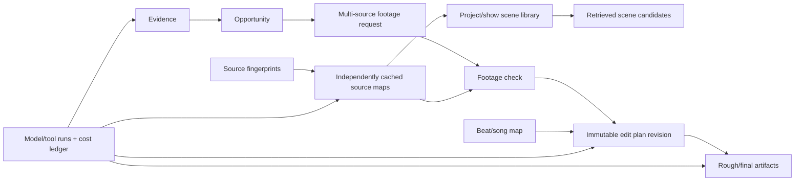

# Data Model

The data model keeps four kinds of truth separate:

1. **External evidence** — current, attributed, policy/TTL constrained.
2. **Local media facts** — tied to an immutable source fingerprint and exact PTS/timebase.
3. **AI assertions/plans** — versioned, explainable, revisable, never silently promoted to fact.
4. **Artifacts/operations** — reproducible outputs, jobs, tools, costs, and failures.

## Storage decision

Use one application SQLite database on a local disk for v1, configured with foreign keys and WAL and managed through numbered SQL migrations. The trusted Rust core is the sole connection/migration/write owner; it sends immutable inputs to the Python worker and persists returned canonical contracts in transactions. Store large media, proxies, thumbnails, reports, and renders as files under validated app/project roots; SQLite stores metadata and hashes, not video blobs.

FTS5 handles transcript/description search. Dense vectors are normalized BLOBs behind a `VectorIndex` interface and brute-forced for episode-scale data until a benchmark justifies `sqlite-vec`. No database service is required.

## Conventions

- Primary IDs: UUIDv4 text generated by trusted application code.
- Event timestamps: UTC Unix milliseconds in SQLite; API contracts render RFC 3339 UTC.
- Media time: signed integer PTS plus positive integer time-base numerator/denominator. Raw container/stream PTS can be negative. Milliseconds/seconds are derived display values, never the edit authority.
- Money: integer micro-USD plus provider-native cost ticks/units as text.
- Hashes: lowercase SHA-256 hex; source fingerprints also include size and probe-relevant stream signature.
- Enumerations: checked constraints and versioned application enums; unknown provider values live in raw metadata, not core enums.
- JSON: allowed for immutable raw provider/tool payloads and versioned contract snapshots. Frequently queried relationships/constraints are relational.
- Deletion: soft-state only where audit history is legally/operationally allowed. Provider-deletion duties and user source/artifact deletion perform real purges.

## Lineage



Every arrow is represented by stable foreign keys/join rows, not a prose-only model rationale.

## Entity groups

### Project and source safety

| Table | Essential fields and constraints |
|---|---|
| `project` | `id`, name, root path handle, status, default aspect numerator/denominator (4/3), created/updated time, active plan revision, project hard budget. Root must be user-selected/app-validated. |
| `project_setting` | Project-scoped typed key/value with schema version; no secret values. |
| `media_asset` | `id`, project, role (`SOURCE_VIDEO`, `SONG`, `PROXY`, `MEZZANINE`, etc.), canonical path handle, original display name, size, mtime observation, SHA-256, ownership/import mode, created time. Source roles are immutable. |
| `media_stream` | Asset, ffprobe stream index/type/codec, width/height, pixel/sample aspect, nominal/average rate rationals, sample rate/channels, duration PTS/timebase, language/disposition, raw probe snapshot. Unique `(asset_id, stream_index)`. |
| `asset_clock_mapping` | Source revision, video/audio stream indices and signature hashes, each stream's origin PTS/timebase, resolver/evidence/version/confidence. Used to prove mapped picture/audio interval endpoints; an opaque UUID alone is insufficient. |
| `artifact` | Project/job, kind, path handle, SHA-256, size, producing operation/tool/model/plan revision, state (`PARTIAL`, `VERIFIED`, `FAILED`, `DELETED`), created/verified time. A verified artifact path cannot equal any source path. |
| `tool_installation` | Tool, executable handle, version/build/configuration/hash, license class, discovery source, last preflight, capabilities. No arbitrary executable supplied by model/UI text. |

Source media is never opened for writing. Working files use a unique job run directory; publishable output is staged and verified on its destination volume before same-volume atomic replace. Cross-volume/network fallback is explicit and never described as atomic.

### Research and provenance

| Table | Essential fields and constraints |
|---|---|
| `research_run` | Project, intent revision, status, freshness cutoff, locale, budget/reservation, started/finished time, summary/warnings. |
| `research_intent_revision` | Immutable normalized intent contract, parent revision, raw user query, schema/prompt/model provenance. |
| `evidence_source` | Provider, provider record ID, source type, canonical URL, title, author/channel, policy class, retrieved/expiry/refresh/purge times, content hash, fetch status. Deduplicate by provider ID and canonical URL/hash rules. |
| `evidence_claim` | Source, claim type, short excerpt/paraphrase/unverified-lead type, text, source-created/published/updated/event/release/retrieved timestamps separately, confidence, raw platform metrics with platform, verification state. |
| `opportunity` | Research run, title/media identity, character/relationship/topic, why-now, creative hook, freshness and evidence scores, gate state, overall confidence, warnings, rank. It never stores “virality probability.” |
| `opportunity_evidence` | Opportunity, claim/source, role (`PRIMARY_RELEASE`, `OFFICIAL_CLIP`, `QUALITATIVE_SIGNAL`, `QUOTE_PROOF`), independence group, contribution/explanation. Unique relationship rows prevent hidden evidence. |
| `footage_request` | Opportunity, immutable revision, conversational summary, minimum-useful-set explanation, preferred source class, spoiler scope, `BEST`/`ALTERNATIVE`/`MINIMUM`/`OPTIONAL_IMPROVEMENT` presentation text, generated provenance. One request can span many episodes, seasons, trailers, clips, or a scene pack. |
| `footage_requirement` | Request, bucket (`REQUIRED`, `OPTIONAL`, `ALTERNATIVE`), stable order, source kind, show/title, nullable season/episode number/title, characters/relationship/topic, scene/moment and likely context, purpose (`INTRO`, `MONTAGE`, `PAYOFF`, `OPTIONAL_CALLBACK`), priority, usefulness and user-effort rank, emotional rationale, verification level (`VERIFIED`, `STRONGLY_SUPPORTED`, `LIKELY_INFERRED`, `UNKNOWN`; UI labels the third “LIKELY / INFERRED”), evidence quality, acceptable-substitution group. Unknown facts stay null/unknown. Numeric seasons accept the bounded `0..9999` range because verified provider metadata can use a calendar year (for example `2026`) as the season identifier. |
| `footage_requirement_quote` | Requirement, short wording or paraphrase, nullable speaker, quote kind, verification level, authoritative claim ID when verified. A quote and its episode location are independently verified; fan repetition cannot promote either. |
| `footage_search_query` | Request and optional requirement, stable order, query text, discovery rationale. It is guidance for user-supplied lawful media—not a download instruction. |
| `footage_requirement_evidence` | Requirement/field, evidence claim, support role, explanation. Keeps source selection, episode, scene, quote, and why-needed claims auditable. |

Raw social bodies are not a default table. Store minimal normalized evidence/citations within provider policy, with provider-specific deletion and refresh jobs.

### Footage intelligence

These are provider-independent domain tables. A Gemini or future provider adapter maps its output into them; no provider response shape becomes the local episode-analysis representation. Their implementation begins only after the focused pre-M2 long-video research gate.

| Table | Essential fields and constraints |
|---|---|
| `show_library` | Project/user library, canonical show identity where known, display title, cache policy/version, created/updated time. It groups reusable source maps without asserting that provider IDs are universal truth. |
| `episode` | Show library, nullable/verified season and episode identifiers/title, release evidence, verification level. One episode can have multiple lawfully supplied media assets; unknown numbering is represented explicitly. |
| `source_analysis` | Media fingerprint, independently cacheable analysis schema/config, status, coarse/fine level, local/cloud method, started/completed time, reusable output handles, provenance. Unique by source fingerprint + tool/model/prompt/schema/config version. |
| `analysis_provenance` | Source analysis, provider/tool, configured and resolved model/version, prompt/schema/config, consent/privacy mode, cost run, provider file/cache reference, cache expiry, input/output hashes, uncertainty. Provider cache identifiers are opaque adapter data, never domain IDs. |
| `subtitle_track` | Media stream/sidecar asset, format/language, source priority, extraction artifact, drift transform, confidence/review state. Preserve the original; normalize a search copy. |
| `transcript_segment` | Track, start/end PTS + timebase, text, speaker cluster/confirmed character separately, word-timing confidence, source (`OFFICIAL`, `ASR`, `OCR`), review state. End > start. |
| `shot` | Video stream, start/end PTS + timebase, start/end frame, detector/version/config, score/confidence, representative-frame artifact. Non-overlap/order validated per detector layer. |
| `semantic_scene` | Source analysis/source/episode, approximate/resolved ranges, provider-independent label/description/emotion/action/event, model run, confidence, resolution state. A resolved scene links local shots/transcript segments. |
| `scene_evidence` | Scene to shot/transcript/model observation with role and confidence. |
| `character` | Project-local stable identity, user-confirmed display name, canonical external IDs if allowed. |
| `character_alias` | Character, alias, source, confirmation state. Model/face clusters cannot create confirmed identity automatically. |
| `character_observation` | Shot/scene, face/voice/text cluster handle, character optional, confidence, evidence. |
| `relationship_assertion` | Character pair/group, scene/time scope, typed assertion, supporting evidence, model/user status, confidence. It is not a timeless factual profile. |
| `visual_moment` | Scene/source analysis, approximate/resolved range, type (reaction, eye contact, touch, pause, parallel, callback, insert, transition handle, other), semantic description, confidence, evidence/provenance. Coarse analysis may nominate it; fine analysis must retain sufficient fidelity before creative use. |
| `scene_candidate` | Scene/range, requested role, selection score dimensions, constraints, explanation, missing-handle flags, model/solver provenance. |
| `footage_check` | Request revision + ordered source-fingerprint set, present/missing/partial/optional status per requirement, cross-file coverage, gaps, sufficiency recommendation, optional improvements, alternatives, analysis version/time. Missing optional material cannot alone make the set insufficient. |
| `video_analysis_estimate` | Project/job, ordered sources, duration/resolution/sampling/file count, cache state, coarse/fine scope, configured/resolved provider/model, token/upload estimate method, batch/flex/server-cache assumptions, per-source and total reserved micro-USD. Created before large uploads/calls where practical. |

### Song analysis

| Table | Essential fields and constraints |
|---|---|
| `music_analysis` | Song asset/fingerprint, analysis/tool versions, duration/timebase, tempo candidates/confidence, cache key. |
| `beat` | Analysis, index, PTS/timebase, type (`BEAT`, `DOWNBEAT`), confidence. |
| `music_section` | Analysis, start/end PTS/timebase, label (`INTRO`, `SECTION_A`, etc.), source (`USER`, `HEURISTIC`), confidence, novelty/energy summary. Algorithmic verse/chorus labels are suggestions. |
| `song_selection` | Project revision, user/manual or chosen section, start/end, handoff preference, rationale. |

### Plans, revisions, and user control

| Table | Essential fields and constraints |
|---|---|
| `edit_plan` | Immutable ID/revision, project, parent revision, grammar/preset-registry versions, concept/thesis, status (`DRAFT`, `ROUGH_APPROVED`, `FINISH_APPROVED`, `SUPERSEDED`), output aspect/frame rate/conform policy, song/beat handoff, ending choice, exact total frames, compiler input hash, and validation report. |
| `edit_clip` | Plan, stable clip ID/contiguous order/role, decoded picture stream/fingerprint/range, separate audio stream/range and asset-clock mapping, source handles, exact timeline frames, crop preset, enabled velocity/transition names+versions, beat anchor, and explanation. No arbitrary curve/keyframe JSON. |
| `edit_clip_evidence` | Clip to scene/shot/transcript/beat/evidence/requirement with selection role. |
| `edit_alternative` | Plan clip, candidate range, rank, tradeoff/explanation, constraint validity. |
| `critique` | Plan/artifact, critic/model or user, structured strengths/issues/suggestions, accepted state, cost. Critiques never mutate a plan. |
| `user_decision` | Project, object/revision, action (`ACCEPT`, `REJECT`, `TRIM`, `REPLACE`, etc.), before/after references, timestamp. |
| `preference_signal` | Derived only from explicit decisions, scoped style/character/context, strength/confidence, derivation version; deletable and never a hidden global profile. |

Edits create new plan revisions. Generated rough/final artifacts always point to the exact immutable revision that produced them.

### Models, tools, jobs, cache, and cost

| Table | Essential fields and constraints |
|---|---|
| `job` | Operation, project, state, idempotency key, protocol/payload schema, input hash, progress, attempt, heartbeat/start/end, cancellation, result/error, run directory. |
| `job_event` | Job, monotonic sequence, type, UTC time, progress/message/sanitized payload. Append-only. |
| `model_run` | Job, provider/configured/resolved model, capability, prompt/schema versions, request ID, input/output hashes, exclusive outcome (`SUCCESS`/`REFUSAL`/`INCOMPLETE`), token/cache/tool usage, retention/data-use mode, start/end. |
| `tool_run` | Job, tool installation, sanitized argv manifest, working/run directory, process/exit state, elapsed, stdout/stderr artifact handles. |
| `price_card` | Provider/model/tool, source URL, currency/unit, Decimal price strings, thresholds, effective/checked/expiry time, content hash. Immutable snapshot. |
| `cost_entry` | Job/model/tool run, state (`RESERVED`, `ACTUAL`, `RELEASED`, `UNVERIFIED`), category, integer micro-USD, provider-native ticks, price card, created/reconciled time. |
| `budget` | Scope type/ID, warning/hard integer micro-USD, period/reset policy, enabled state. |
| `cache_entry` | Namespace/key, input/output hashes, schema/tool/model/prompt versions, policy class, created/accessed/expires time, artifact/contract handle, state/size. |

## Exact time representation

Each edit endpoint is an independently evidenced decoded-stream boundary:

```json
{
  "source_media_id": "f646a81a-5dbd-4762-b0af-cddad172c3fd",
  "source_sha256": "aaaaaaaaaaaaaaaaaaaaaaaaaaaaaaaaaaaaaaaaaaaaaaaaaaaaaaaaaaaaaaaa",
  "stream_signature_sha256": "cccccccccccccccccccccccccccccccccccccccccccccccccccccccccccccccc",
  "stream_index": 0,
  "stream_type": "VIDEO",
  "point": {
    "pts": 347136,
    "time_base": { "numerator": 1, "denominator": 15360 },
    "frame_index": 678
  },
  "boundary_kind": "DECODED_VIDEO_FRAME",
  "resolver_id": "ffmpeg-frame-index-v1",
  "resolution_evidence_id": "89f744a4-f573-477f-a8da-6d716a2989dc",
  "confidence": 0.98
}
```

Display seconds are derived and cannot be round-tripped as authority. A range's endpoints must share source/stream signatures and timebase, have increasing PTS, and—for picture—increasing decoded frame indices. Picture endpoints resolve to decoded video frames; audio endpoints resolve separately to decoded samples and can use a different timebase/offset linked to an evidenced mapping record with both stream origins. Transcript, subtitle, ASR, cloud, and beat times remain semantic anchors until a local frame/sample resolver produces evidence.

## Policy-aware retention

- Evidence rows carry `policy_class`, expiry, refresh, and purge deadlines. A provider adapter owns its policy implementation and kill switch.
- YouTube public/non-authorized metadata is refreshed or deleted within 30 days under the current policy; no audiovisual data or derived engagement score is stored.
- Direct X, if later enabled, stores minimal IDs/aggregates and deletion status; termination purge rules are implemented.
- Reddit content is not stored without a future agreement; if later approved, the adapter follows the current 48-hour recommended purge posture.
- TVmaze free fields remain attributable/share-alike isolated; licensed data records its entitlement/source.
- Search retrieval never grants archive/reuse rights to the underlying page, post, image, trailer, or clip. Persist canonical IDs/URLs, separate dates, minimal excerpt/paraphrase, hash, and policy obligations rather than unrestricted raw response bodies.
- xAI requests/responses currently have a default 30-day retention posture; eligible Zero Data Retention is represented explicitly and verified from the response/header. OpenAI API data is not used for training by default, but abuse-monitoring content may remain up to 30 days and Responses application state must use `store:false` where no storage is intended.
- Local footage/transcript/artifacts are user-controlled. Every cloud query or upload—not only footage—records the displayed provider retention/data-use summary, consent/operation class, and actual retention mode.

## Integrity and indexes

- Unique index on source fingerprint/hash + stream signature.
- Unique provider identity/canonical URL indexes with provider-specific normalization.
- FTS5 external-content tables for transcript segments, scene descriptions, evidence titles/paraphrases, and footage search terms.
- Ordered/check constraints on all PTS ranges, clip timeline ranges, plan clip order, and job event sequence.
- Foreign keys use restrictive deletion for provenance and cascading deletion only inside a deliberate project/provider purge transaction.
- Startup asserts foreign keys, journal mode, integrity, migration version, FTS5, and SQLite runtime >=3.51.3. The M1 Rust dependency must vendor that floor and test it; the current workspace Python reports SQLite 3.51.1 and is not release evidence.
- Periodic content-hash verification detects moved/changed source files; it invalidates dependent cache layers without deleting the source.

## Migration and contract strategy

SQL migrations are forward-only, numbered, transactional, and tested from every supported previous version. AI/API contract versions are independent from database schema versions. Store both the parsed relational form and the immutable original contract snapshot so a later migration cannot rewrite what a model/provider actually returned.
